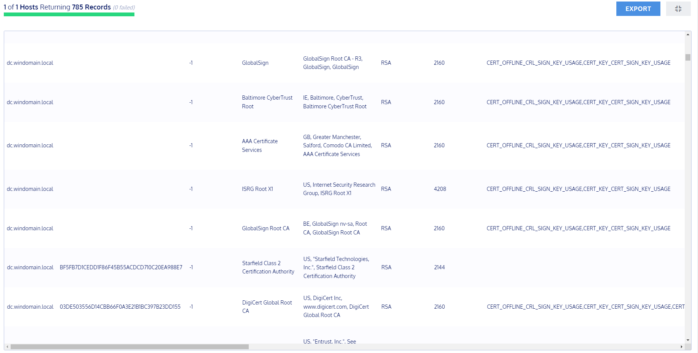
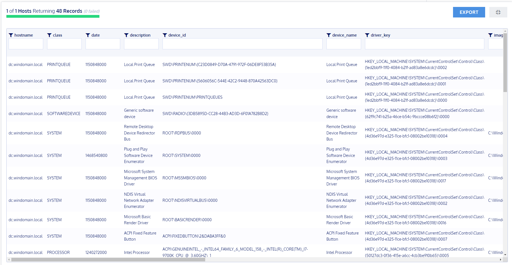

# Fleet

Fleet ist ein weit verbreiteter OSQuery Manager. 
Er ermöglicht es Live-Abfragen zu programmieren und Echtzeit Visualisierungen von tausenden Clients.
Mit Fleet können OSQuery-Abfragen gruppiert werden und mit Schedules geplant werden.
Die neuste Version 4.24.1 von Fleet wurde am 07.12.2022 veröffentlicht.

## Testing

Fleet liefert einige nützliche Queries mit. Ich werde als Beispiel die Queries "certificates" und "drivers" testen:

### certificates

Die Query ist in der Lage alle vertrauten Zertifikate auf meinen Systemen auszulesen.
Damit kann festgestellt werden, ob ein Host ein unvertrauenswürdiges Zertifikat installiert hat.
```sql
SELECT * FROM certificates WHERE path != 'Other People';
```

Output:\
 \

### drivers

Diese Query sucht alle Treiber eines Systems. Treiber Probleme können genaustens Analysiert werden und Anomalien festgestellt werden.
Gerade im Client-Management sehe ich hier einen grossen Nutzen.
```sql
ELECT * FROM drivers;
```

Output:\
 \
