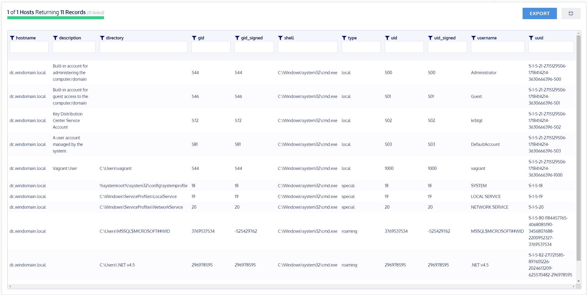

# OSQuery

Im Grunde stellt OSQuery eine umfangreiche Datenbank des Betriebssystems eines Clients zusammen.
Die Datenbank kann per SQL-Queries abgefragt werden. Dabei stellen die Tabellen der Datenbank jegliche Teile des Clients dar.
Zum Beispiel installierte Software, Users oder Netzwerkkommunikationen.
Abfragen können automatisiert als Job ausgeführt werden um bestimmte Teile von wichtigen Systemmen zu monitoren. Damit können ungewünschte Änderungen, Eindringlinge oder Schadsoftwares entdeckt werden.

OSQuery ist ein Open Source Projekt und unterstützt die Anwendung auf Windows, MacOS und verschiedenen Linux Systeme.
Die aktuelle Version ist 5.6.0

## Test

Mittels OSQuery frage ich meinen alle meine Hosts nach den darauf enthaltenen Benutzern ab.
Dazu verwende ich eine einfache Query:
```sql
SELECT * FROM users
```
\
 \