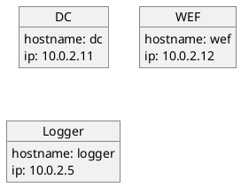

# Beschreibung der VMs

## Domain Controller

username: vagrant
password: vagrant

### Software

- Google Chrome
- Microsoft Advanced Threat Analytics Gateway
- Microsoft Visual C++ 2013 Redistributable (x64)
- Microsoft Visual C++ 2015-2022 Redistributable (x64)
- Microsoft Visual C++ 2015-2022 Redistributable (x86)
- Notepad++ (64-bit x64)
- Velociraptor
- WinRAR (64-bit)
- Wireshark 64-bit

## wef

username: vagrant
password: vagrant

### Software

- Google Chrome
- Microsoft Advanced Threat Analytics Gateway
- Microsoft Visual C++ 2013 Redistributable (x64)
- Microsoft Visual C++ 2015-2022 Redistributable (x64)
- Microsoft Visual C++ 2015-2022 Redistributable (x86)
- Notepad++ (64-bit x64)
- Velociraptor
- WinRAR (64-bit)
- Wireshark 64-bit

## logger

username: vagrant
password: vagrant

# Netzwerk

