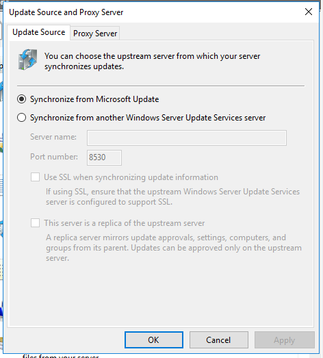

# WSUS

WSUS (Windows Server Update Service) wird verwendet, um kontrolliert, zentral Updates für Windows Server und Windows Clients zu verwalten.

Alternativen zu WSUS sind beispielsweise:
 - Ivanti Security Controls
 - ManageEngine Patch Manager Plus

## WSUS-Cmdlets

Add-WsusComputer	
Adds a client computer to a target group.

Add-WsusDynamicCategory	
Adds a dynamic category to a WSUS server.

Approve-WsusUpdate	
Approves an update to be applied to clients.

Deny-WsusUpdate	
Declines the update for deployment.

Get-WsusClassification	
Gets the list of all WSUS classifications currently available in the system.

Get-WsusComputer	
Gets the WSUS computer object that represents the client computer.

Get-WsusDynamicCategory	
Gets dynamic categories on a WSUS server.

Get-WsusProduct	
Gets the list of all products currently available on WSUS.

Get-WsusServer	
Gets the WSUS update server object.

Get-WsusUpdate	
Gets the WSUS update object with details about the update.

Invoke-WsusServerCleanup	
Performs the process of cleanup on a WSUS server.

Remove-WsusDynamicCategory	
Removes a dynamic category from a WSUS server.

Set-WsusClassification	
Sets whether the classifications of updates that WSUS synchronizes are enabled.

Set-WsusDynamicCategory	
Sets the synchronization status of a dynamic category.

Set-WsusProduct	
Sets whether the product representing the category of updates to synchronize is enabled.

Set-WsusServerSynchronization	
Sets whether the WSUS server synchronizes from Microsoft Update or an upstream server.

## Installation und Konfiguration

WSUS wird als Service im Server Manager auf einem Windows Server installiert.
In diesem Fall nutze ich den Domain Controller als WSUS.

<!-- tabs:start -->

### **Update Source and Proxy Server:**
 \
Mein WSUS lädt sich die Updates direkt von Microsoft herunter, da kein anderer WSUS in meinem Netz verfügbar ist.

### **Products and Classification:**
 \
Bei der Wahl der Produkte habe ich mich für sehr wenige Client spezifische Updates entschieden, da der Server nur zu Testzwecken verwendet wird, benötige ich nicht die volle Pallette.

### **Update Files and Languages:**
 \
Der Server lädt die Updates erst auf seine lokale Festplatte, wenn diese auch genehmigt wurden.

### **Synchronization Schedule:**
 \
Für die Synchronisation habe ich keine Zeit festgelegt, da ich für den Test den Sync manuell ausführen kann.

### **Computers:**
\
Ich habe eine GPO erstellt, welche die Client geräte automatisch in die Updategruppe "Group 1" verschiebt.

<!-- tabs:end -->

Die restlichen Optionen der WSUS-Konfiguration habe ich auf den Standardeinstellungen belassen.

Folgende GPOs habe ich erstellt um den WSUS in Verbindung mit einem Client nutzen zu können.

<!-- tabs:start -->

### **Client Targeting**
 \
Die Policy "Enable client-side targeting" teilt dem Client mit, dass er zur Updategruppe "Group 1" gehört.

### **Auto Update & Intern Path**
 \
Die Policy "Configure Automatic Updates" teilt dem Client mit, dass dieser die Updates automatisch herunterladen soll, diese aber erst nach einer Benachrichtigung an den User installieren soll. \
Die Policy "Specify intranet Microsoft update Service location" übergibt dem Client den Pfad, an welchem er sich seine Updates holen muss.

<!-- tabs:end -->

## Testing

Grundsätzlich ist es möglich aus allen Objekten im WSUS einen Report zu ziehen.
Ob aus einem Update, einem Client oder auch aus einem Sync, kann ein Report exportiert werden.

